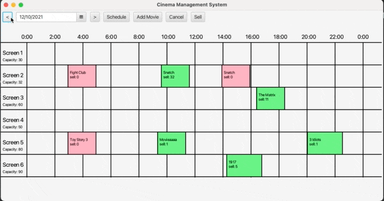

# COMP3013J_Assignment

## Group Setup

[19206226 - WangYuyang  Personal Information](19206226.md)

[19206202 - ZhangYiteng Personal Information](19206202.md)

[19206206 - WenruiLiu  Personal Information](19206206.md)

[19206207 - YangLiuxin  Personal Information](19206207.md)

## Project preview


## Use Case

##### Use Case 1:

Display Screening Tickets Sold Capacity

##### Use Case 2:

Schedule Movie Screening

##### Use Case 3:

Reschedule Movie Screening

##### Use Case 4:

Cancel Movie Screening

##### Use Case 5:

Sell Tickets

## Build

To build this project, it would be easier if you have maven installed. Please run the following command in the terminal:

```shell
mvn clean
mvn compile
```

## Package

```shell
mvn package -Dmaven.test.skip=true
```

## Run

You can either use IDEA to start the project or use the following command in the terminal after the package stage:

```shell
java -jar target/COMP3013J-1.0-SNAPSHOT-jar-with-dependencies.jar
```

## Project Screenshots


